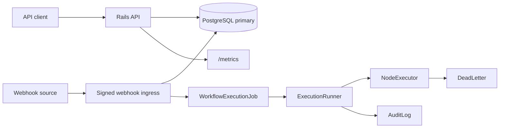

# FlowBridge

FlowBridge is a hybrid Rails monolith for reliable webhook-driven automation. It receives signed SaaS or fintech webhooks, deduplicates them, executes immutable workflow versions asynchronously, records node-level evidence, and gives operators an authenticated ERB/Hotwire console for inspection, retry, and dead-letter handling.

## Reviewer guide

If you are evaluating this repository as a senior Ruby on Rails or technical leadership portfolio project, start with [docs/evaluation-guide.md](docs/evaluation-guide.md). It explains the fastest validation path and the engineering signals the project is designed to demonstrate.

## What is this product?

FlowBridge is a backend automation product for teams that need Zapier-like workflow execution with stronger operational guarantees. The product surface is hybrid: JSON APIs and signed webhooks for machines, plus a server-rendered operator console for humans.

## Problem it solves

Webhook automation often fails in production because payloads are duplicated, workflow definitions mutate while events are in flight, third-party APIs return transient failures, and operators cannot see exactly which node failed. FlowBridge solves this by making workflow versions immutable, enforcing webhook signatures and idempotency, and persisting every execution step.

## Target users

- SaaS platform teams wiring customer lifecycle events into CRMs, billing systems, and internal tools.
- Fintech operations teams that need replay-safe integrations and auditable execution history.
- Backend engineers evaluating reliable asynchronous workflow architecture in Rails.

## Main features

- Multi-tenant organizations with API key roles: owner, operator, and viewer.
- Immutable workflow versions with graph checksums and per-version webhook secrets.
- Signed webhook ingestion with idempotency keys and correlation ID propagation.
- Async workflow execution through Active Job with retry, exponential backoff, and dead-letter creation.
- Node-level execution evidence including input, output, duration, error code, and attempt number.
- Encrypted credential storage with secret-safe response masking.
- Operator endpoints for execution inspection, manual retry, dead-letter retry, and dead-letter resolution.
- JSON structured logs, request IDs, correlation IDs, readiness checks, and Prometheus metrics.

## Architecture overview

FlowBridge is a modular Rails monolith. API controllers keep machine traffic under `/api/v1`, web controllers expose the operator console, and domain behavior lives under `app/services/flow_bridge`.



See [docs/architecture/overview.md](docs/architecture/overview.md) and [docs/diagrams/container.md](docs/diagrams/container.md).

## Tech stack

- Ruby 3.4+
- Rails 8.1 hybrid monolith
- Active Record
- Active Job
- PostgreSQL for development, test, and production
- ERB, Turbo, Stimulus, Importmap, and Propshaft
- Solid Queue, Solid Cache, and Solid Cable
- Rails authentication generator and bcrypt
- Active Storage and Action Mailer
- Minitest
- Fixtures and Capybara system tests
- RuboCop Rails Omakase
- Brakeman and bundler-audit
- OpenTelemetry instrumentation hooks
- Prometheus text metrics
- k6 benchmark scripts
- Docker, Thruster, Kamal, and GitHub Actions

## Domain model

- `Organization`: tenant boundary and rate-limit owner.
- `ApiKey`: bearer token digest, role, token lifecycle, and permission mapping.
- `Workflow`: mutable product container for workflow metadata.
- `WorkflowVersion`: immutable executable graph with trigger key, encrypted webhook secret, retry policy, and checksum.
- `Credential`: encrypted third-party credential scoped to one organization.
- `WebhookEvent`: signed inbound event with idempotency key and sanitized headers.
- `WorkflowExecution`: async execution state machine and correlation ID anchor.
- `NodeExecution`: per-node evidence with attempt, timing, inputs, outputs, and error payloads.
- `DeadLetter`: terminal failure queue for operator retry or resolution.
- `AuditLog`: tenant-scoped operational record for sensitive actions.

## API documentation

The OpenAPI contract is [openapi.yaml](openapi.yaml). Human-readable examples live in [docs/api/http-examples.md](docs/api/http-examples.md), and the standardized error format is documented in [docs/api/error-format.md](docs/api/error-format.md).

All product endpoints are versioned under `/api/v1`. Webhook ingress uses `/api/v1/webhooks/{trigger_key}` with `X-FlowBridge-Signature` and `X-FlowBridge-Event-Id`.

## Async or event architecture

Webhook ingestion persists the event and execution in one database transaction, then enqueues `WorkflowExecutionJob`. The job executes the immutable workflow version node by node. Retriable failures schedule another job according to the version retry policy. Exhausted or non-retriable failures create a `DeadLetter` record. This is documented in [docs/architecture/data-consistency.md](docs/architecture/data-consistency.md).

## Database design

The schema uses explicit tenant foreign keys, uniqueness constraints for API key digests, workflow slugs, workflow version numbers, trigger keys, webhook idempotency keys, and execution idempotency keys. Check constraints protect status fields and non-negative counters. See [db/schema.rb](db/schema.rb) and [docs/architecture/data-consistency.md](docs/architecture/data-consistency.md).

## Testing strategy

Minitest covers:

- model validations and database constraints
- API request flows
- authorization and tenant isolation
- signed webhook ingestion
- idempotency
- retry and dead-letter behavior
- Active Job execution
- metrics and rate limiting
- repository spec compliance
- OpenAPI shape checks
- operator login and dead-letter resolution through Capybara system tests

Run tests with:

```bash
bin/rails test:all
```

## Performance benchmarks

k6 scripts live in [benchmarks/](benchmarks/). The documented local baseline is [benchmarks/baseline.md](benchmarks/baseline.md), with methodology in [docs/benchmarks/methodology.md](docs/benchmarks/methodology.md). Benchmark scenarios include smoke, load, stress, and spike tests.

## Observability

FlowBridge exposes:

- JSON structured logs through `FlowBridgeJsonFormatter`
- `X-Request-Id` and `X-Correlation-Id`
- `/up` liveness
- `/ready` database and queue readiness
- `/metrics` Prometheus text format
- OpenTelemetry instrumentation hooks behind `OTEL_ENABLED=true`
- a Grafana dashboard definition in [docs/diagrams/grafana-flowbridge-overview.json](docs/diagrams/grafana-flowbridge-overview.json)

## Security considerations

Security controls include bearer API key digests, role-based authorization, tenant-scoped queries, encrypted credential material, webhook HMAC signatures, idempotency keys, secret masking, rate limiting, audit logs, environment-based secret management, Brakeman, and bundler-audit. See [docs/security/threat-model.md](docs/security/threat-model.md) and [docs/security/authorization-matrix.md](docs/security/authorization-matrix.md).

## Trade-offs and decisions

Key decisions are captured as ADRs:

- [ADR 001: PostgreSQL-backed hybrid Rails monolith](docs/adr/001-postgresql-hybrid-rails-monolith.md)
- [ADR 002: Immutable workflow versions](docs/adr/002-immutable-workflow-versions.md)
- [ADR 003: Database-backed dead letters before external broker adoption](docs/adr/003-database-backed-dead-letters.md)

The main trade-off is using Active Job and database state instead of RabbitMQ in this implementation slice. The design still models retry queues, idempotency, acknowledgement boundaries, and dead letters explicitly, while keeping the project runnable without external services.

## How to run locally

PostgreSQL must be running locally. By default the app connects as the current OS user and creates `flowbridge_development`, `flowbridge_development_queue`, `flowbridge_development_cache`, and `flowbridge_development_cable`.

```bash
bundle install
bin/rails db:prepare
bin/rails server
```

Seeded development operator:

```text
operator@flowbridge.local / password123
```

Create a tenant:

```bash
curl -s http://localhost:3000/api/v1/organizations \
  -H "Content-Type: application/json" \
  -d '{"organization":{"name":"Demo Ops"}}'
```

## How to run tests

```bash
bin/rails test:all
bin/rubocop
bin/brakeman --no-pager
bin/bundler-audit
```

The CI entrypoint is:

```bash
bin/ci
```

## CI/CD

GitHub Actions runs the production-readiness checks on pull requests and pushes to `main`:

- PostgreSQL-backed Rails tests and Capybara system tests
- RuboCop Rails Omakase
- Brakeman
- bundler-audit
- Redocly OpenAPI linting
- Docker image build

Deployment is manual through the `Deploy` workflow. It uses Kamal and requires a protected `production` environment with these repository variables:

- `APP_HOST`
- `KAMAL_IMAGE`
- `KAMAL_REGISTRY_USERNAME`
- `KAMAL_WEB_HOST`

And these repository secrets:

- `KAMAL_SSH_PRIVATE_KEY`
- `KAMAL_REGISTRY_PASSWORD`
- `RAILS_MASTER_KEY`
- `SECRET_KEY_BASE`
- `DATABASE_URL`
- `QUEUE_DATABASE_URL`
- `CACHE_DATABASE_URL`
- `CABLE_DATABASE_URL`

## Failure scenarios

- Invalid API key returns `401 unauthorized`.
- Role mismatch returns `403 forbidden`.
- Tenant boundary violations return `404 not_found`.
- Invalid webhook signature returns `401 invalid_webhook_signature`.
- Duplicate webhook idempotency key returns `202 accepted` with `duplicate: true`.
- Transient node failure moves the execution to `retrying`.
- Exhausted retries create an open `DeadLetter`.
- Non-retriable node failure creates an open `DeadLetter` immediately.

Operational steps are in [docs/runbooks/common-issues.md](docs/runbooks/common-issues.md).

## Roadmap

- Add a visual workflow graph editor.
- Add a RabbitMQ adapter while retaining the current database-backed idempotency and audit trail.
- Add OAuth credential connectors and rotation workflows.
- Add graph validation for dependencies, fan-out, and conditional branches.
