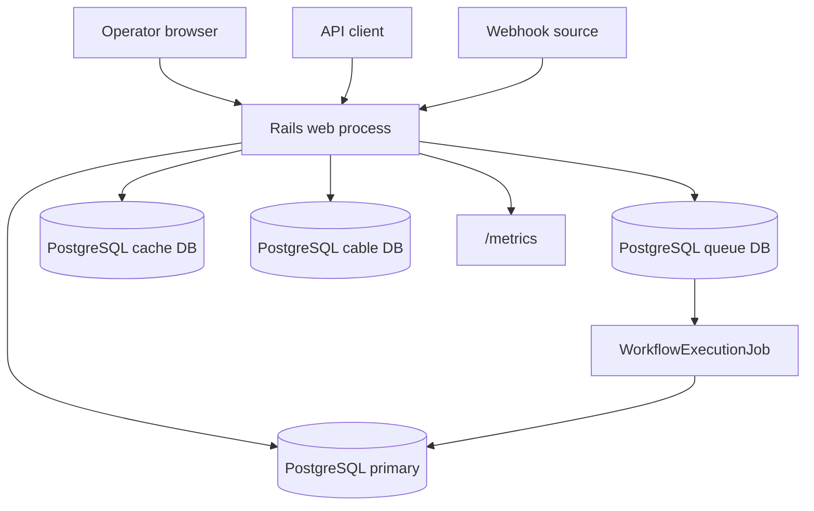

# C4 Container

## Containers

| Container | Responsibility |
| --- | --- |
| Rails web process | API, webhook ingress, operator console, health/readiness/metrics. |
| Workflow execution job | Async execution of immutable workflow versions. |
| PostgreSQL primary | Tenant data, workflows, executions, node evidence, credentials, audit logs. |
| PostgreSQL queue DB | Solid Queue tables for durable jobs. |
| PostgreSQL cache DB | Solid Cache tables. |
| PostgreSQL cable DB | Solid Cable tables. |
| Docker image | Production runtime with Thruster and Rails server. |
| Kamal deployment | Manual production deployment path. |

## Why this shape

The system is consistency-sensitive and benefits from one application boundary. PostgreSQL-backed Solid services reduce infrastructure for the MVP while preserving a path to split worker and queue infrastructure later.
