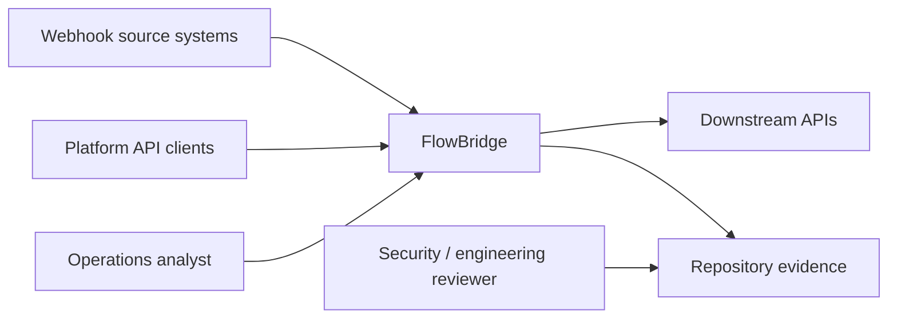

# C4 Context

## External actors

- Webhook source systems send signed events.
- API clients manage organizations, workflows, credentials, executions, and dead letters.
- Operators inspect and remediate failures through the server-rendered console.
- Downstream APIs are represented by deterministic mock nodes in the MVP.
- Reviewers evaluate product, architecture, security, operation, and test evidence through docs and CI.

## Trust boundaries

- Public API and webhook ingress are untrusted network boundaries.
- Operator console is trusted only after Rails session authentication.
- Database is the source of truth for tenant state, execution evidence, and Solid services.
- Deployment secrets live outside the repository in environment variables and GitHub secrets.
