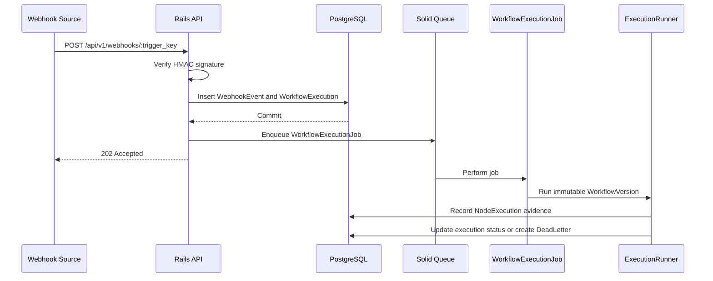
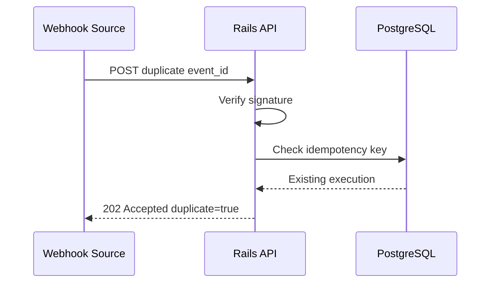
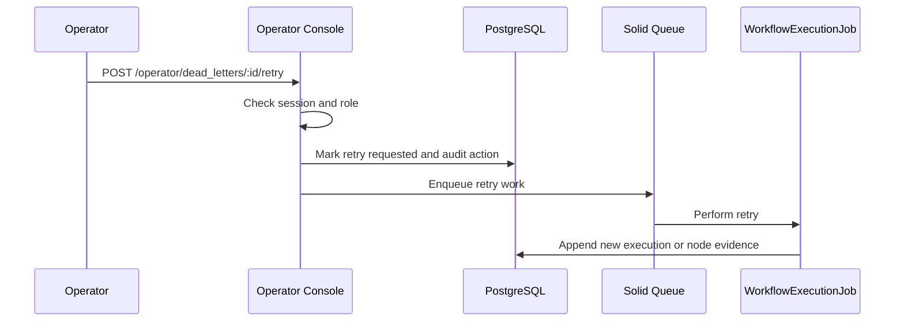

# Sequence Diagrams

## Webhook ingestion and async execution

```mermaid
sequenceDiagram
  participant Source as Webhook Source
  participant API as Rails API
  participant DB as PostgreSQL
  participant Queue as Solid Queue
  participant Worker as WorkflowExecutionJob
  participant Engine as ExecutionRunner

  Source->>API: POST /api/v1/webhooks/:trigger_key
  API->>API: Verify HMAC signature
  API->>DB: Insert WebhookEvent and WorkflowExecution
  DB-->>API: Commit
  API->>Queue: Enqueue WorkflowExecutionJob
  API-->>Source: 202 Accepted
  Queue->>Worker: Perform job
  Worker->>Engine: Run immutable WorkflowVersion
  Engine->>DB: Record NodeExecution evidence
  Engine->>DB: Update execution status or create DeadLetter
```

## Duplicate webhook delivery

```mermaid
sequenceDiagram
  participant Source as Webhook Source
  participant API as Rails API
  participant DB as PostgreSQL

  Source->>API: POST duplicate event_id
  API->>API: Verify signature
  API->>DB: Check idempotency key
  DB-->>API: Existing execution
  API-->>Source: 202 Accepted duplicate=true
```

## Operator dead-letter retry

```mermaid
sequenceDiagram
  participant Operator as Operator
  participant Web as Operator Console
  participant DB as PostgreSQL
  participant Queue as Solid Queue
  participant Worker as WorkflowExecutionJob

  Operator->>Web: POST /operator/dead_letters/:id/retry
  Web->>Web: Check session and role
  Web->>DB: Mark retry requested and audit action
  Web->>Queue: Enqueue retry work
  Queue->>Worker: Perform retry
  Worker->>DB: Append new execution or node evidence
```
