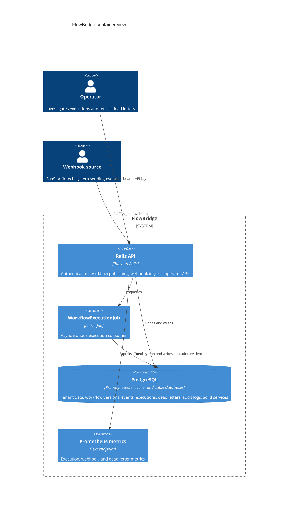

# Container Diagram

```mermaid
C4Container
title FlowBridge container view

Person(operator, "Operator", "Investigates executions and retries dead letters")
Person(source, "Webhook source", "SaaS or fintech system sending events")

System_Boundary(flowbridge, "FlowBridge") {
  Container(api, "Rails API", "Ruby on Rails", "Authentication, workflow publishing, webhook ingress, operator APIs")
  Container(job, "WorkflowExecutionJob", "Active Job", "Asynchronous execution consumer")
  ContainerDb(db, "PostgreSQL", "Primary, queue, cache, and cable databases", "Tenant data, workflow versions, events, executions, dead letters, audit logs, Solid services")
  Container(metrics, "Prometheus metrics", "Text endpoint", "Execution, webhook, and dead-letter metrics")
}

Rel(operator, api, "Uses bearer API key")
Rel(source, api, "POST signed webhook")
Rel(api, db, "Reads and writes")
Rel(api, job, "Enqueues")
Rel(job, db, "Reads graph and writes execution evidence")
Rel(api, metrics, "Exposes /metrics")
```
