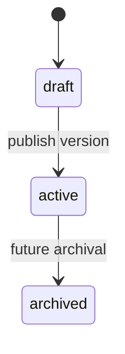
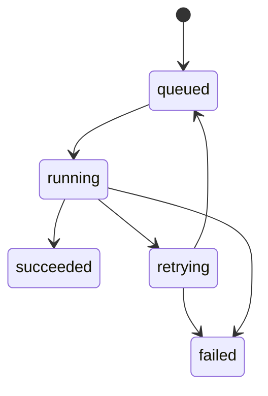
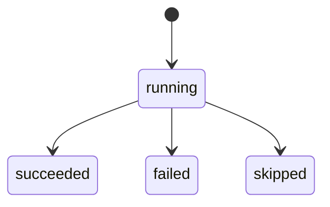
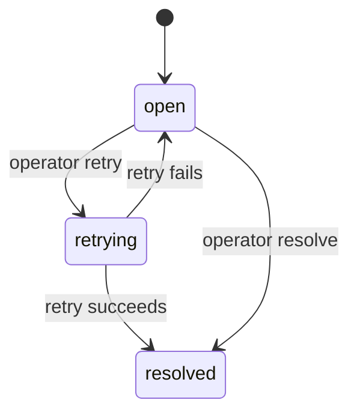

# State Machines

## Workflow

Implemented states:

- `draft`
- `active`

## Workflow execution

Failure behavior:

- retryable node failures move execution to `retrying` until retry policy is exhausted.
- exhausted or non-retryable failures move execution to `failed` and create a dead letter.

## Node execution

Node evidence records attempt number, timing, input, output, and error details.

## Dead letter

Dead letters remain operational evidence after resolution.
